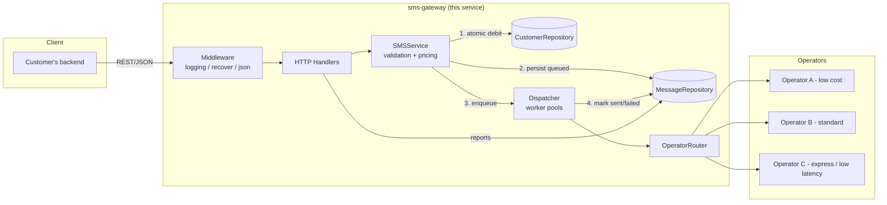

# Architecture

This document describes how the SMS Gateway is designed, why it's designed
that way, and how it would evolve to meet the scale described in the
challenge brief (tens of thousands of businesses, on the order of 100M
messages/day, uneven traffic distribution across operators).

## 1. Requirements → design decisions

| Requirement (from the brief) | Design decision |
|---|---|
| No auth / user-management system | Customers are plain billable entities created via an open `POST /customers`. No login, tokens, or sessions anywhere. |
| Any customer can send to any number | `POST /sms` takes `receiver` as free text; no allow-list / ownership of numbers. |
| Customers can view their own sent-message reports | `GET /sms?customer_id=...` with type/status filters and pagination. |
| Every customer has a limited, prepaid balance | `Customer.Balance` (integer Rials — never a float, to avoid rounding drift). |
| **No message may ever be sent once balance is exhausted** | Balance is checked-and-debited **atomically and synchronously**, before the message is queued for delivery. See §3. |
| Traffic is not evenly distributed across operators; some customers are high-volume/low-price, others low-volume/high-price | `OperatorRouter` abstracts operator selection behind an interface, decoupling pricing/routing policy from the send path. |
| Special "dynamic password" (OTP) and Express (guaranteed delivery-time) services | `MessageType` (`normal`/`otp`/`express`) drives both pricing and routing; Express gets its own worker pool and a hard per-message deadline so normal traffic bursts can never blow its SLA. |
| English/Persian priced the same, all messages single-page | Pricing is a flat per-message amount per type — no per-segment or per-encoding computation. |
| REST API only, no GUI | Plain JSON over HTTP, stdlib `net/http` router (Go 1.22 method+path patterns), no server-rendered views. |
| 7-day timebox, any language, Golang a plus | Go, standard library only (see §6 for why zero third-party dependencies). |

## 2. High-level architecture



The important property of this flow is that **steps 1 and 2 happen inside
the HTTP request**, synchronously, before the API responds. Step 3
(actual delivery to an operator) happens asynchronously afterwards. This
is what lets the API return quickly regardless of operator latency,
while still guaranteeing the customer was charged for, and only for,
messages that were actually accepted.

## 3. The core invariant: never overspend

This is the requirement the brief calls out explicitly, so it gets a
dedicated design discussion.

**The rule:** a customer's balance must never go negative, and a message
must never be handed to an operator unless it has already been paid for.

**The race this has to defend against:** two (or a few thousand)
concurrent `POST /sms` requests for the same customer, each individually
affordable, but not affordable *together*. A naive "read balance, check
if enough, then write new balance" sequence has a classic time-of-check
to time-of-use gap: two goroutines can both read the same starting
balance, both decide it's sufficient, and both deduct — overspending the
account.

**The fix:** `CustomerRepository.DebitBalance` performs the entire
read-check-write sequence while holding a lock scoped to that one
customer (see `internal/repository/memory/customer_repository.go`). No
other goroutine can observe or mutate that customer's balance mid-debit.
Concurrency across *different* customers is untouched — each customer
has its own lock, so one customer's traffic never blocks another's.

This is verified directly, not just asserted: see
`TestDebitBalance_NeverOversells` and
`TestSendMessage_ConcurrentSendsNeverOversell`, both run under `go test
-race`. They fire hundreds of concurrent sends against a balance that
can only cover a fraction of them and assert that (a) the balance never
goes negative and (b) the number of successful sends times the price
exactly equals what left the balance — i.e. no lost updates, no double
spends, no phantom debits.

**What happens if persistence of the message fails after the debit
succeeds?** The service refunds the debit (see `SMSService.SendMessage`)
— a customer is never charged for a message that didn't actually get
queued.

**What happens if the *operator* rejects the message after billing?**
The message is marked `failed`, but this implementation does not
auto-refund it. That's a genuine product decision (refund vs. retry vs.
dead-letter for manual reconciliation), not an oversight — see §7.

## 4. Layering

```
cmd/api            → composition root: wires config, repos, operators, dispatcher, service, HTTP server
internal/domain     → entities, value objects, repository interfaces, sentinel errors — no framework code
internal/service     → use cases (SMSService), operator routing, async dispatcher
internal/repository/memory → in-memory implementations of the domain repository interfaces
internal/transport/http    → HTTP handlers, routing, middleware, request/response mapping
internal/config      → environment-based configuration
internal/idgen       → dependency-free UUID generation
```

`internal/domain` defines `CustomerRepository` and `MessageRepository` as
interfaces; `internal/service` depends only on those interfaces, never on
the concrete in-memory implementation. That's what makes §6's "swap
storage backend" story a real, low-risk option rather than a rewrite.

## 5. Handling uneven operator traffic and the Express SLA

`OperatorRouter` holds two operator pools: `standard` (normal + OTP
traffic) and `express` (Express traffic only). This directly reflects
the brief's note that traffic distribution across operators isn't even —
some customers push huge low-margin volume, others send rarely at a
premium price — by giving routing policy its own component instead of
hard-coding a single operator into the send path. A production version
of `Route()` would pick operators by live cost/capacity/latency
telemetry per operator rather than the simple weighted-random pick used
here.

Express messages get a `DeliveryDeadline` computed at accept time and a
`context.WithDeadline` wrapped around the operator call
(`Dispatcher.process`), and — just as importantly — their own worker
pool (`EXPRESS_WORKERS`) and queue, separate from normal/OTP traffic. A
flood of normal sends can fill the normal queue without ever delaying an
Express message, because Express messages are never waiting behind them.

## 6. Why zero third-party dependencies

`go.mod` lists no requirements. This was a deliberate choice for a
timeboxed challenge submission, not a general recommendation:

- The project builds, tests, and runs with nothing but `go build` — no
  `go.sum` to audit, no supply-chain surface, no version drift between a
  reviewer's machine and CI.
- The API surface used (a router with method+path patterns, a JSON
  encoder/decoder, a mutex) is small enough that the standard library
  covers it cleanly.

In a longer-lived production system, I would still reach for a router
package (e.g. `chi`) once route middleware/grouping gets more elaborate,
and a structured logger (`slog`, which is stdlib as of Go 1.21, is
actually already the natural next step over the current `log.Printf`
calls).

## 7. What changes at real scale (100M messages/day ≈ ~1,150 msg/s average, bursty)

The in-memory storage in this submission is intentionally the simplest
thing that satisfies the brief's correctness requirements within a
7-day, GUI-less, auth-less scope. It does **not** persist across
restarts and does not run multiple replicas consistently. Here is the
concrete path from here to a production deployment, following the same
interfaces already defined in `internal/domain`:

**Balance storage.** Move `CustomerRepository` to PostgreSQL, using
`SELECT ... FOR UPDATE` (or a single `UPDATE customers SET balance =
balance - $1 WHERE id = $2 AND balance >= $1 RETURNING balance`, which
is atomic without an explicit lock) inside a transaction — the same
check-then-debit atomicity the in-memory mutex gives today, just at the
database level so it holds across multiple API replicas. For very high
write concurrency on hot customer rows, a Redis-backed balance (atomic
`DECRBY` guarded by a Lua script that checks sufficiency first) in front
of Postgres as the durable ledger is a common pattern — Redis absorbs
the hot path, Postgres remains the source of truth via periodic/event
reconciliation.

**Message ingestion & delivery.** Replace the in-process channels in
`Dispatcher` with a durable broker (Kafka or RabbitMQ). The API's job
stays exactly the same — debit, persist as `queued`, publish — but
publishing to a broker instead of an in-memory channel means accepted
messages survive an API process crash. Delivery workers become their
own horizontally-scaled service consuming from `normal` and `express`
topics/queues (mirroring today's two-pool design), so Express throughput
is provisioned independently of normal-traffic volume.

**Message storage & reporting.** Move `MessageRepository` to
PostgreSQL, partitioned by time (e.g. monthly partitions) since reports
are typically queried by recent date range per customer; add a
`(customer_id, created_at)` index for the report query. At 100M/day
sustained, read replicas or a separate reporting store (e.g. ClickHouse)
would take report queries off the write path entirely.

**Horizontal scaling.** The API layer is already stateless (all state
lives behind the repository interfaces), so it scales horizontally
behind a load balancer with no code changes once the repositories are
backed by shared storage instead of in-process memory.

**Operator routing at scale.** `OperatorRouter` would incorporate
per-operator circuit breakers (stop routing to an operator that's
erroring/timing out), live weighting by cost and observed latency, and
per-customer routing rules (a customer negotiated a rate with a specific
operator).

**Idempotency.** Add an `Idempotency-Key` request header honored on
`POST /sms`, so a client retry after a network timeout can't double-send
and double-charge — currently not needed because there's no client retry
behavior to defend against in this submission's scope, but it's the
first thing to add before this API is safe to expose to real retrying
clients.

**Observability.** Structured logs (already have leveled request
logging via middleware; would move to `slog` + a log pipeline),
Prometheus metrics (queue depth, debit success/failure rate, per-operator
latency and error rate, Express SLA hit rate), and tracing across the
API → broker → delivery-worker → operator hop.

## 8. Testing strategy

- **Unit tests, repository layer:** prove the balance-safety invariant
  directly under `-race`, both for the "just enough funds for some
  requests" case and the simple insufficient-funds/unknown-customer
  cases.
- **Unit tests, service layer:** the same concurrency property, driven
  through the actual use case (`SMSService.SendMessage`) rather than the
  repository directly, plus input-validation edge cases.
- **Integration tests, HTTP layer:** `httptest`-based tests drive the
  real router and middleware stack end-to-end (create customer → attempt
  send with no balance → top up → send → list reports), which is the
  same contract real clients depend on.

Run everything with `make test-race` (or `go test ./... -race -cover`).
